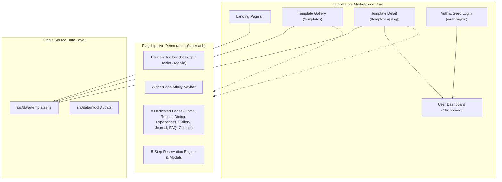
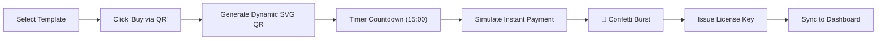
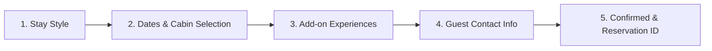

# Templestore — Master Project Handover Blueprint

> **Phase 1 Status:** Complete & Production Verified  
> **Flagship Template:** Alder & Ash — Forest Resort (`/demo/alder-ash`)  
> **Tech Stack:** Next.js 16 (App Router), TypeScript, Tailwind CSS, Framer Motion, next-themes  

This document serves as the master engineering and architectural handover blueprint for **Templestore**. It consolidates all system plans, component blueprints, data layer protocols, and operational flowcharts required for a complete handover.

---

## 📑 Handover Documentation Suite

Detailed sub-specifications are organized in the [`/docs`](file:///D:/New%20project/Templestore/docs) folder:

1. [**System Architecture Blueprint (`docs/ARCHITECTURE.md`)**](file:///D:/New%20project/Templestore/docs/ARCHITECTURE.md)  
   *Component boundaries, Next.js App Router layout hierarchy, viewport isolation, and client/server component breakdown.*

2. [**User Journeys & Logic Flowcharts (`docs/FLOWCHARTS.md`)**](file:///D:/New%20project/Templestore/docs/FLOWCHARTS.md)  
   *Mermaid flowcharts for discovery, dynamic QR payments, card checkout, protected dashboard routes, and the 5-step resort booking engine.*

3. [**Data Layer & Extensibility Guide (`docs/DATA_LAYER_GUIDE.md`)**](file:///D:/New%20project/Templestore/docs/DATA_LAYER_GUIDE.md)  
   *How to add or modify templates in `src/data/templates.ts` in under 3 minutes without touching any UI component.*

4. [**Design System & Tokens Specification (`docs/DESIGN_SYSTEM.md`)**](file:///D:/New%20project/Templestore/docs/DESIGN_SYSTEM.md)  
   *Marketplace glassmorphic CSS tokens, luxury SVG icons, Fraunces serif typography, and the Alder & Ash forest color palette.*

5. [**Deployment & Operations Handover (`docs/DEPLOYMENT_HANDOVER.md`)**](file:///D:/New%20project/Templestore/docs/DEPLOYMENT_HANDOVER.md)  
   *Vercel, Docker, self-hosted deployment runbooks, and Phase 2 backend integration stubs for Stripe, database auth, and email dispatch.*

---

## 🏛️ Master System Blueprint



---

## 🔄 Core Handover Flowcharts

### 1. Dynamic QR Code Purchasing & Verification Flow


### 2. Alder & Ash 5-Step Resort Reservation Flow


---

## 🚀 Quick Start Runbook for New Developers

### 1. Clone & Install
```bash
git clone <repository-url>
cd Templestore
npm install
```

### 2. Start Development Server
```bash
npm run dev
```
Navigate to:
- **Marketplace**: `http://localhost:3000`
- **Alder & Ash Live Demo**: `http://localhost:3000/demo/alder-ash`
- **User Dashboard**: `http://localhost:3000/dashboard`

### 3. Verify Production Build
```bash
npm run build
```
*Expected: Compiled successfully with zero TypeScript and lint errors.*

---

## 🛡️ Handover Verification Checklist

- [x] **Production Build Clean**: Next.js 16 + Turbopack builds with 0 errors.
- [x] **Single Source of Truth**: All templates populated via `src/data/templates.ts`.
- [x] **Alder & Ash Flagship Template**: Replaced Nova, live on `/demo/alder-ash` with all 8 pages, authentic photography, and 5-step booking flow.
- [x] **Responsive Mode Support**: Toolbar enables testing in Desktop (100%), Tablet (768px), and Phone (390px) viewports with mobile drawer navigation.
- [x] **Luxury Bespoke Iconography**: Custom gradient SVG glyphs in `src/components/ui/Icons.tsx` with zero duplicate graphics.
- [x] **Dark / Light Mode**: Segmented theme toggle with persistent state.
- [x] **Auth & Dashboard Seed Suite**: Preloaded accounts for Alex Designer and Sarah Developer.
- [x] **Documentation Complete**: Dedicated architectural, flowchart, design, and deployment documents committed to repository.
