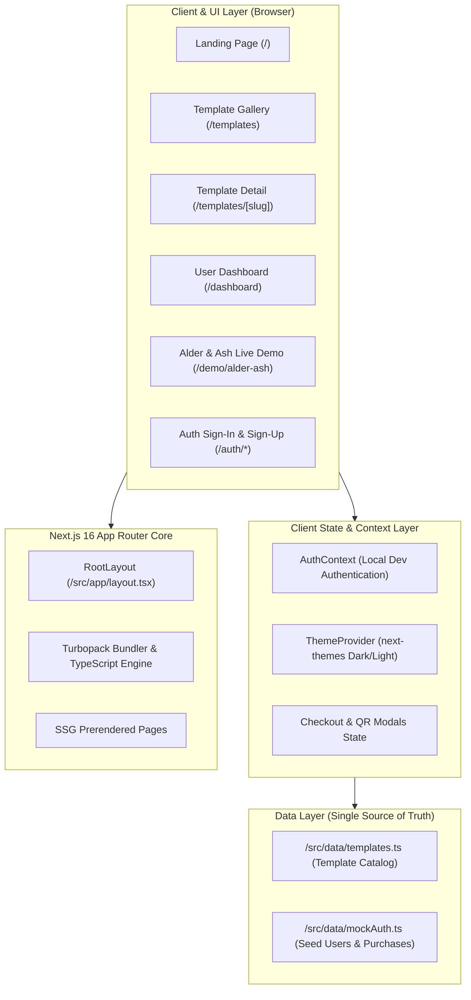
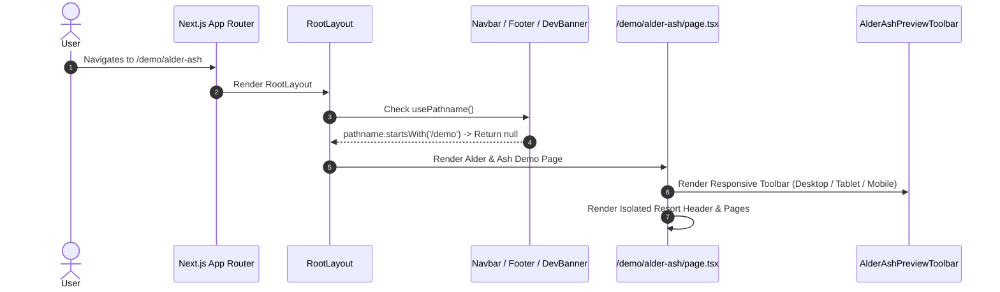

# Templestore — System Architecture Blueprint

This document details the architectural blueprint of **Templestore**, a Next.js 14+ (Next.js 16 App Router) marketplace for discovering, previewing, and purchasing web application and website templates.

---

## 1. High-Level System Architecture

Templestore is engineered using a modular, decoupled architecture. The template catalog is separated from the UI presentation layer via a single-source-of-truth data layer.



---

## 2. Directory & Module Boundaries

```text
Templestore/
├── docs/                           # Handover blueprints, flowcharts, and architecture specs
│   ├── ARCHITECTURE.md             # This document
│   ├── FLOWCHARTS.md               # User journeys and interactive logic flowcharts
│   ├── DATA_LAYER_GUIDE.md         # Template catalog schema and customization guide
│   ├── DESIGN_SYSTEM.md            # Glassmorphism tokens, luxury icons, and palette
│   └── DEPLOYMENT_HANDOVER.md      # Hosting, Vercel, Docker, and Phase 2 backend stubs
├── public/                         # Public static assets
│   ├── previews/                   # High-res template mockups (alder-1.jpg, etc.)
│   ├── logo.png                    # Brand logo
│   └── logo-mark.png               # Precision cropped monogram emblem
├── src/
│   ├── app/                        # Next.js App Router route segments
│   │   ├── auth/                   # Sign-in and sign-up with 1-click dev seed login
│   │   ├── contact/                # Contact inquiry page with validation
│   │   ├── dashboard/              # User dashboard (downloads, licenses, receipts)
│   │   ├── demo/alder-ash/         # Fully interactive multi-page live template demo
│   │   ├── templates/              # Gallery (/templates) & Detail (/templates/[slug])
│   │   ├── globals.css             # Tailwind v4 glassmorphic styles & design tokens
│   │   ├── layout.tsx              # Root layout with theme, auth, and fonts
│   │   └── page.tsx                # Marketplace landing homepage
│   ├── components/
│   │   ├── demo/alder-ash/         # Dedicated components for the Alder & Ash demo
│   │   │   ├── AlderAshNavbar.tsx
│   │   │   ├── AlderAshFooter.tsx
│   │   │   ├── AlderAshPreviewToolbar.tsx
│   │   │   ├── AlderAshBookingModal.tsx
│   │   │   ├── AlderAshRoomModal.tsx
│   │   │   ├── AlderAshArticleModal.tsx
│   │   │   ├── AlderAshLightbox.tsx
│   │   │   ├── data.ts
│   │   │   └── types.ts
│   │   ├── layout/                 # Global Navbar, Footer, DevBanner
│   │   ├── providers/              # ThemeProvider
│   │   ├── templates/              # TemplateCard, TemplateFilter, TemplateGallery,
│   │   │                           # QRCodeModal, DirectCheckoutModal, ContactModal
│   │   └── ui/                     # Button, Input, Modal, Badge, ThemeToggle, Icons
│   ├── context/
│   │   └── AuthContext.tsx         # In-memory authentication & simulated purchase state
│   ├── data/
│   │   ├── templates.ts            # ⭐ PRIMARY DATA LAYER: Single source of truth
│   │   └── mockAuth.ts             # Preloaded seed accounts and transactions
│   └── types/
│       └── index.ts                # Strict TypeScript interfaces
```

---

## 3. Server vs. Client Component Boundaries

To optimize performance and eliminate client-side JavaScript overhead:

| Route / Component | Boundary | Rationale |
| :--- | :--- | :--- |
| `src/app/layout.tsx` | Server Component | Loads Google Fonts (`Fraunces`, `Manrope`), root metadata, and base layout. |
| `src/app/page.tsx` | Client Component | Uses `framer-motion` entrance animations and dynamic template tabs. |
| `src/app/templates/page.tsx` | Client Component | Real-time search query, category filtering, and sorting without page reloads. |
| `src/app/templates/[slug]/page.tsx` | Client Component | Dynamic purchase modals, QR payment simulation, and tab switching. |
| `src/app/demo/alder-ash/page.tsx` | Client Component | Interactive multi-page tabs, lightbox, 5-step booking engine, device switcher. |
| `src/app/dashboard/page.tsx` | Client Component | Reads authenticated state from `AuthContext`, generates receipts, copies license keys. |
| `src/components/layout/Navbar.tsx` | Client Component | Route detection, mobile menu drawer toggle, dark/light theme trigger. |
| `src/components/ui/Icons.tsx` | Client Component | Tailored SVG gradient components with glowing filter effects. |

---

## 4. Live Demo Viewport Isolation Architecture

When a user visits `/demo/alder-ash`, the marketplace navigation (`Navbar`, `Footer`, and `DevBanner`) detects the `/demo` prefix via `usePathname()` and gracefully unmounts:



### Responsive Viewport Frame Engine
The demo page contains a device-simulation wrapper:
- **`desktop`**: Renders `w-full min-h-screen` (natural 100% fluid layout).
- **`tablet`**: Wraps content in `max-w-[768px] mx-auto my-6 rounded-3xl shadow-2xl border-4 border-slate-700/60`.
- **`mobile`**: Wraps content in `max-w-[390px] mx-auto my-6 rounded-3xl shadow-2xl border-4 border-slate-700/60`.
- **`fullscreen`**: Toggles off the top toolbar for a full presentation experience.

Because all demo components utilize standard Tailwind breakpoints (`sm:`, `md:`, `lg:`), the site renders responsively both inside the simulation frames and when accessed directly from physical mobile and tablet devices.

---

## 5. Security & Dev Mode Architecture

- **Allowed Dev Origins**: Configured in `next.config.ts` (`allowedDevOrigins: ['192.168.1.15', 'localhost']`) to allow secure cross-device LAN testing without CORS or host-header warnings.
- **Local Dev Testing Suite**: `DevBanner` allows one-click switching between preloaded demo user identities (`Alex Designer` and `Sarah Developer`) and guest mode, persisting session state inside `AuthContext`.
