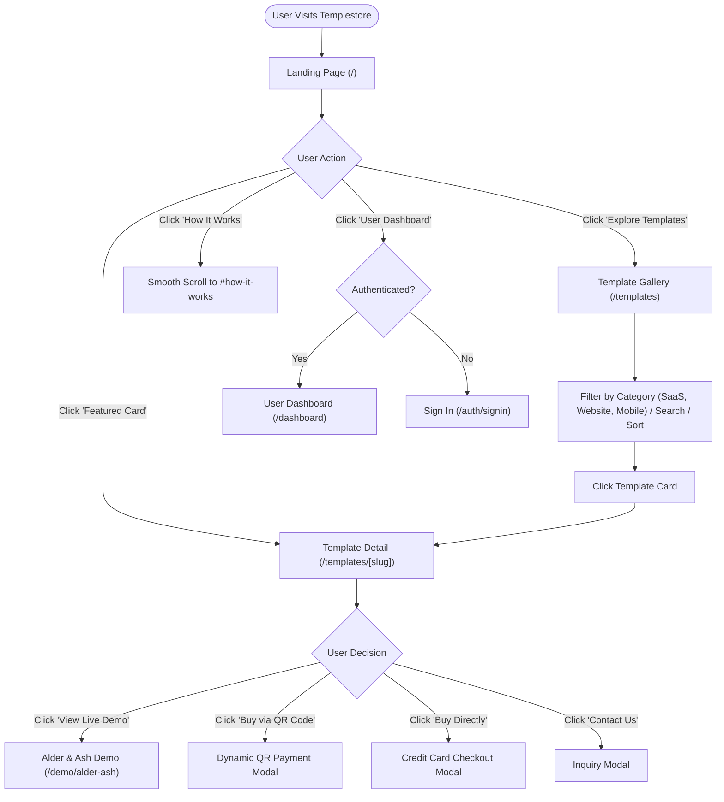
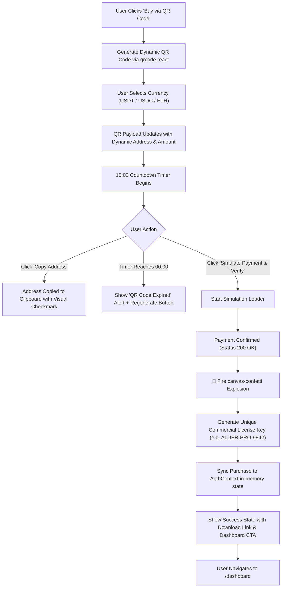
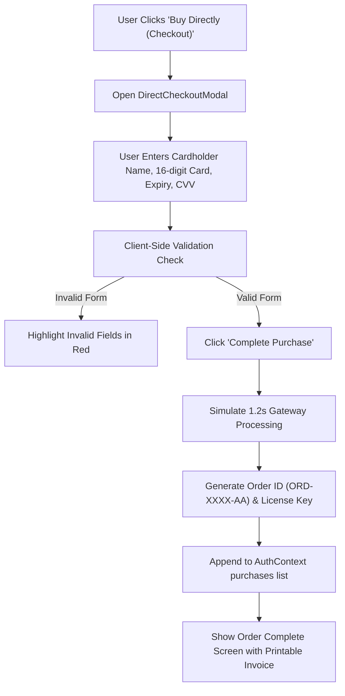
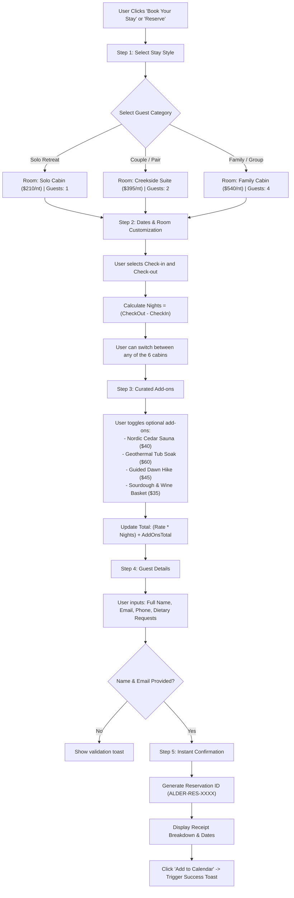
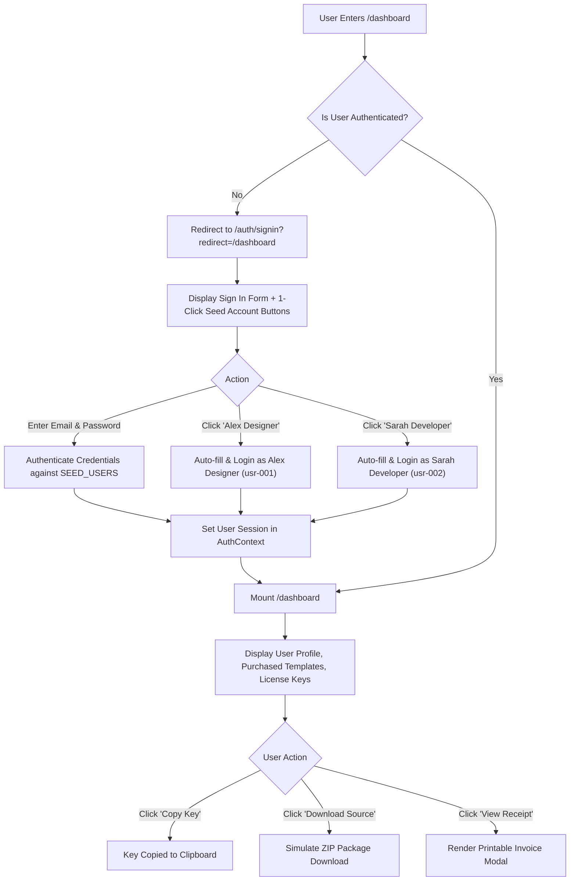

# Templestore — User Journeys & Logic Flowcharts

This document outlines the operational flowcharts, decision trees, and interaction lifecycles implemented throughout Templestore.

---

## 1. Complete Marketplace Navigation & Discovery Flow

---

## 2. Dynamic QR-Code Purchasing Flow

---

## 3. Direct Credit Card Checkout Flow

---

## 4. Alder & Ash 5-Step Resort Reservation Flow

This flowchart governs the interactive booking engine on `/demo/alder-ash`:

---

## 5. User Authentication & Dashboard Protected Route Flow

